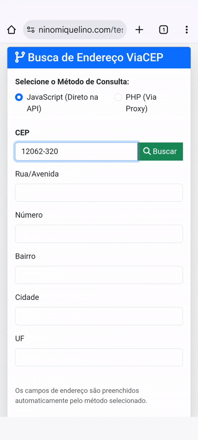

## 👨‍💻 Autor

<div align="center">
  
  <br>
  <strong>Onivaldo Miquelino</strong>
  <br>
  <a href="https://github.com/ninomiquelino">@ninomiquelino</a>
</div>

---

# 🧭 Consulta CEP


Aplicação simples e prática para **consulta de endereços a partir do CEP**, utilizando a API pública [ViaCEP](https://viacep.com.br/).

Permite testar as consultas tanto no **frontend (JavaScript)** quanto no **backend (PHP)** — ideal para aprender, integrar ou demonstrar consumo de APIs REST.

---

## ⚙️ Funcionalidades
- 🔍 Consulta de CEP e retorno de logradouro, bairro, cidade, estado e complemento.  
- ✅ Validação básica do formato do CEP.  
- 💡 Exemplos práticos de uso em **JavaScript (frontend)** e **PHP (backend)**.  
- 🌐 Integração fácil com formulários e sistemas externos.  

---

## 🧩 Estrutura do Projeto
```
Consulta_CEP/
📁 docs/
│   ├── index.html
│   └── consulta_cep.php
│   └── assets/
│       ├── css/style.css
│       └── js/script.js
├── README.md
├── .gitignore
└── LICENSE
```
---

## 🚀 Visualizar na prática

### 🔸 Frontend (JavaScript)
👉 [**Acesse o site online**](https://ninomiquelino.github.io/consulta-cep/)  
Digite um CEP e veja o resultado instantaneamente na interface.

<p align="center">
  
</p>

---

### 🔹 Backend (PHP)
Execute localmente (em XAMPP, WAMP ou Laragon):

http://localhost/Consulta_CEP/docs/consulta_cep.php?cep=01001000

Você também pode testar em qualquer serviço de hospedagem PHP gratuita (ex.: 000webhost, InfinityFree).

---

## 🧠 Tecnologias utilizadas
- 💻 HTML5 / CSS3
- ⚡ JavaScript (ES6+)
- 🐘 PHP 8.3+
- 🌐 API ViaCEP

---

## 📦 Como usar
1. Clone este repositório:
   ```bash
   git clone https://github.com/ninomiquelino/Consulta_CEP.git

---   

## 🧾 Licença
Distribuído sob a licença **MIT**.  
Consulte o arquivo [LICENSE](LICENSE) para mais detalhes.

---

## 🤝 Contribuições
Contribuições são sempre bem-vindas!  
Sinta-se à vontade para abrir uma [*issue*](https://github.com/NinoMiquelino/Consulta_CEP/issues) com sugestões ou enviar um [*pull request*](https://github.com/NinoMiquelino/Consulta_CEP/pulls) com melhorias.

---

## 💬 Contato
📧 [Entre em contato pelo LinkedIn](https://www.linkedin.com/in/onivaldomiquelino/)  
💻 Desenvolvido por **Onivaldo Miquelino**

---

### 🏷️ Explicando os badges:
| Badge | Significado |
|--------|--------------|
| 🟣 **Made with PHP** | Indica a principal linguagem usada no backend |
| 🟡 **Frontend JavaScript** | Mostra a stack usada na interface |
| 🟢 **License MIT** | Mostra a licença do repositório |
| 💙 **Version 1.0.0** | Versão estável do projeto |
| ✅ **Status Stable** | Mostra que o projeto está funcionando corretamente |

---
